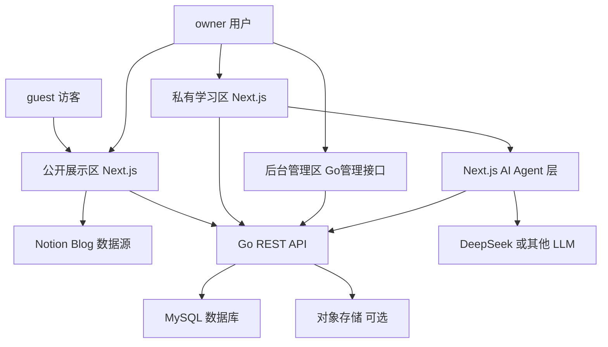
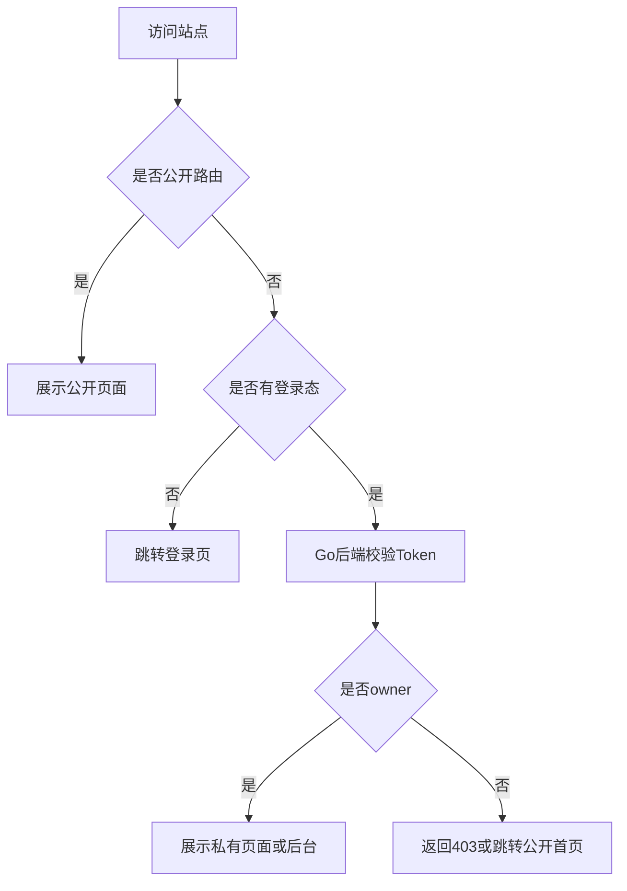
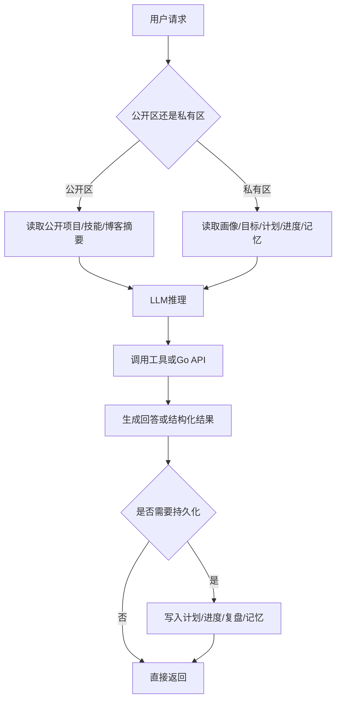

# SDD：AI 学习规划与成长记录平台

## 1. 文档信息

| 项目 | 内容 |
| --- | --- |
| 文档名称 | AI 学习规划与成长记录平台软件设计文档 |
| 文档类型 | SDD / Software Design Document |
| 当前版本 | V1.0 |
| 编写日期 | 2026-05-10 |
| 关联产品 | 个人作品集升级项目 |
| 技术方向 | Next.js 前台 + Notion 博客 + Go 后端 + 数据库 + AI Agent |

## 2. 概要

### 2.1 背景

当前项目已经是一个个人作品集网站，具备公开展示能力，包括首页、关于页、项目页、博客页和 AI 聊天入口。现有实现中：

- 首页与聊天入口位于 `app/page.tsx`、`components/chat/ChatWindow.tsx`。
- 项目数据主要来自本地 JSON，读取逻辑位于 `lib/content/projects.ts`。
- 个人信息、技能、联系方式等主要来自 `content/about/*.json` 或页面硬编码，读取逻辑位于 `lib/content/about.ts`。
- 博客已经直接连接 Notion，读取逻辑位于 `lib/notion.ts`，列表页位于 `app/blog/page.tsx`。
- AI Agent 已具备基础 ReAct 能力，核心位于 `lib/ai/agent-core.ts`，流式接口位于 `app/api/chat-agent-stream/route.ts`。

本次升级的目标是在个人作品集基础上，扩展为一个“AI 学习规划与成长记录平台”：系统能够记住用户学习画像、持续记录学习目标和进度、自动生成学习计划，并支持周复盘与权限隔离。

### 2.2 功能目标

V1 需要完成以下能力：

- 保留公开作品集能力，面向访客 / 面试官展示个人信息、项目、博客和 AI 产品能力。
- 将当前写死或本地 JSON 的个人信息、联系方式、项目、站点配置逐步迁移到 Go 后端和数据库。
- 博客继续由 Next.js 直连 Notion，不纳入 Go 后台 CRUD。
- 新增私有学习工作台，支持学习画像、目标、计划、进度、周复盘。
- 新增基础权限控制，区分公开区、私有区、后台管理区。
- 扩展 AI Agent，使其可以基于长期画像和历史进度生成学习计划与复盘建议。

### 2.3 非功能目标

- 安全性：学习画像、目标、计划、进度、复盘、AI 对话记忆默认私有。
- 可维护性：公开展示数据、学习数据、AI 记忆数据统一结构化存储。
- 展示价值：体现 `Next.js + Notion + Go + 数据库 + AI Agent` 的全栈整合能力。
- 可扩展性：V1 不做复杂 RBAC，但数据模型需要支持后续扩展。
- 可演示性：保证“建档 → 生成计划 → 打卡 → 周复盘 → AI 调整建议”的闭环可演示。

## 3. 需求范围

### 3.1 用户角色

| 角色 | 说明 | 权限 |
| --- | --- | --- |
| `guest` | 未登录访客、面试官、普通浏览者 | 访问公开首页、作品集、博客、关于页；不能访问学习数据 |
| `owner` | 站点所有者，也就是用户本人 | 访问公开区、私有学习区、后台管理区；管理个人数据和学习数据 |

V1 只实现 `guest` 与 `owner` 两类角色，不设计复杂 RBAC。

### 3.2 页面范围

#### 公开页面

- `/`：首页，展示个人定位、社交入口、项目/博客/关于入口、AI 聊天入口。
- `/portfolio`：项目作品集，未来从 Go 后端获取项目数据。
- `/portfolio/[slug]`：项目详情页。
- `/about`：关于页，未来从 Go 后端获取公开个人信息、技能、经历、联系方式。
- `/blog`：博客列表页，继续从 Notion 获取数据。
- `/blog/[id]`：博客详情页，继续从 Notion 获取内容块。

#### 私有页面-也想搞成左菜单右内容的样式

- `/dashboard`：学习工作台首页，展示当前目标、今日任务、整体进度、AI 建议和快捷打卡。
- `/profile`：学习画像管理，包括技能基础、目标岗位、能力短板、学习偏好。
- `/goals`：学习目标管理，包括目标名称、截止日期、优先级、状态。
- `/plans`：学习计划管理，包括 AI 生成计划、阶段任务、任务状态和计划调整。
- `/progress`：学习进度记录，包括日/周打卡、任务完成情况、阻塞问题。
- `/review/weekly`：每周复盘，包括本周记录、自我反思、AI 总结、下周建议。

#### 后台管理页面

- `/admin/dashboard`：后台仪表盘。
- `/admin/profile`：公开个人信息管理。
- `/admin/projects`：项目管理。
- `/admin/site-config`：站点配置管理。
- `/admin/learning/*`：学习画像、目标、计划、进度、复盘数据管理。
- `/admin/system/*`：用户、权限、接口日志、系统配置。

## 4. 设计意义

### 4.1 用户价值

- 用户不需要每次向 AI 重新描述简历、技能、目标和历史进度。
- 用户可以连续记录学习过程，形成结构化成长轨迹。
- 用户可以获得基于真实进度的周计划、复盘建议和下一步调整。

### 4.2 产品价值

- 个人网站从静态作品集升级为可持续使用的 AI 学习产品。
- 访客仍然可以浏览公开内容，面试官可以看到完整全栈项目能力。
- 私有学习数据不对外暴露，兼顾展示价值和隐私保护。

### 4.3 技术价值

- 前台体现 Next.js App Router、流式 AI 交互、Notion 内容集成能力。
- 后端体现 Go、数据库建模、鉴权、接口设计、后台管理能力。
- AI 层体现 ReAct Agent、长期记忆、上下文隔离、结构化任务生成能力。

## 5. 总体架构设计

### 5.1 架构分层



### 5.2 系统模块

| 模块 | 所属层 | 说明 |
| --- | --- | --- |
| 公开展示模块 | Next.js | 首页、关于、作品集、博客、公开 AI 问答 |
| 博客模块 | Next.js + Notion | 博客数据继续由 Notion 提供，不进入 Go CRUD |
| 私有学习模块 | Next.js | Dashboard、学习画像、目标、计划、进度、周复盘 |
| AI Agent 模块 | Next.js API | 基于现有 `PersonalAIAgent` 演进，负责计划生成、复盘总结、建议生成 |
| 后端服务模块 | Go | 鉴权、公开内容接口、学习数据接口、AI 数据持久化接口 |
| 后台管理模块 | Go 管理接口 | 管理个人信息、项目、站点配置、学习数据、系统日志 |
| 数据存储模块 | MySQL | 存储用户、公开配置、项目、学习数据、AI 记忆 |

### 5.3 数据源边界

| 数据类型 | 当前来源 | V1 目标来源 | 是否进入 Go 后台 |
| --- | --- | --- | --- |
| 博客文章 | Notion | Notion | 否 |
| 博客标签 | Notion | Notion | 否 |
| 首页文案 | 页面硬编码 / JSON | Go 后端 + 数据库 | 是 |
| 个人简介 | 页面硬编码 / JSON | Go 后端 + 数据库 | 是 |
| 联系方式 | `content/about/contact.json` | Go 后端 + 数据库 | 是 |
| 技能信息 | `content/about/skills.json` | Go 后端 + 数据库 | 是 |
| 项目作品 | `content/projects/*.json` | Go 后端 + 数据库 | 是 |
| 学习画像 | 暂无 | Go 后端 + 数据库 | 是 |
| 学习目标 | 暂无 | Go 后端 + 数据库 | 是 |
| 学习计划 | 暂无 | Go 后端 + 数据库 | 是 |
| 学习进度 | 暂无 | Go 后端 + 数据库 | 是 |
| 周复盘 | 暂无 | Go 后端 + 数据库 | 是 |
| AI 对话与记忆 | 暂无持久化 | Go 后端 + 数据库 | 是 |

## 6. 权限与访问控制设计

### 6.1 路由权限

| 路由 | 权限 | 说明 |
| --- | --- | --- |
| `/` | 公开 | 首页 |
| `/portfolio` | 公开 | 项目列表 |
| `/portfolio/[slug]` | 公开 | 项目详情 |
| `/about` | 公开 | 关于页 |
| `/blog` | 公开 | Notion 博客列表 |
| `/blog/[id]` | 公开 | Notion 博客详情 |
| `/dashboard` | owner | 私有学习工作台布局入口，默认展示概览 |
| `/profile` | owner | 工作台内容区：学习画像 |
| `/goals` | owner | 工作台内容区：学习目标 |
| `/plans` | owner | 工作台内容区：学习计划 |
| `/progress` | owner | 工作台内容区：学习进度 |
| `/review/weekly` | owner | 工作台内容区：周复盘 |
| `/admin/*` | owner | 后台管理 |

### 6.2 鉴权方案

V1 推荐采用 Go 后端签发 JWT，Next.js 前台保存登录态并在请求 Go API 时携带 Token。

- 登录成功后 Go 后端返回 `access_token` 和基础用户信息。
- Next.js 在私有页面请求前校验登录态。
- Go 后端所有私有接口通过 JWT 中间件校验 Token。
- 所有学习型数据查询必须带 `owner_id` / `user_id` 归属条件。
- 后台管理接口仅允许 `owner` 调用。

### 6.3 权限流转



### 6.4 数据权限原则

- 学习画像、目标、计划、任务、进度、周复盘、AI 记忆默认私有。
- 项目、公开个人信息、站点配置默认公开，但由后台控制是否展示。
- 博客内容由 Notion 控制发布状态，Next.js 只读取已发布内容。
- 后续如需展示学习成果，只能展示摘要字段，不直接暴露原始复盘或 AI 记忆。

## 7. 前端设计

### 7.1 公开区

#### 首页 `/`

当前首页已经具备沉浸式视觉和 AI 聊天入口。V1 建议保留视觉风格，同时补充平台入口：

- Hero：个人定位、个性标签、联系方式。
- 项目预览：展示 2-3 个代表项目，来自 Go 公共项目接口。
- 博客预览：展示 Notion 最新文章，仍从 Notion 获取。
- AI 产品入口：说明“AI 学习规划与成长记录平台”的项目亮点。
- 工作台入口：登录后进入 `/dashboard`，未登录进入登录页。

#### 作品集 `/portfolio`

现有 `app/portfolio/page.tsx` 通过 `getAllProjects()` 读取本地 JSON。V1 迁移后：

- 服务端请求 Go 接口 `GET /api/public/projects`。
- 支持技术栈筛选。
- 项目卡片展示标题、短描述、技术栈、封面、GitHub/Demo 链接。
- 项目详情请求 `GET /api/public/projects/{slug}`。

#### 关于页 `/about`

现有 `app/about/page.tsx` 渲染 `AboutPageClient`，其中部分内容硬编码。V1 迁移后：

- 请求 Go 接口 `GET /api/public/profile`。
- 展示公开简介、技能、经历、联系方式。
- 后台可维护展示字段。

#### 博客 `/blog`

博客继续由 `lib/notion.ts` 对接 Notion：

- 列表：`getPublishedPosts()`。
- 详情：`getPostById()`、`getPostBlocks()` 或 `getPostContent()`。
- Go 后端不提供博客 CRUD，不存储博客正文。
- SDD 中只把 Blog 作为公开展示模块和外部内容源，不纳入后台内容管理。

### 7.2 私有学习区

私有学习区采用统一的“左侧菜单 + 右侧内容”工作台布局，而不是每个页面独立设计一套页面框架。

- 左侧菜单固定展示学习模块入口：概览、学习画像、学习目标、学习计划、学习进度、周复盘。
- 右侧内容区根据当前路由切换对应功能页面。
- `/dashboard` 作为工作台默认首页，展示总体概览、今日任务、AI 建议和快捷打卡。
- `/profile`、`/goals`、`/plans`、`/progress`、`/review/weekly` 作为工作台内容区的不同菜单页面。
- 移动端左侧菜单收起为抽屉菜单，避免影响记录进度和复盘。

```text
+----------------------+------------------------------------------------+
| 学习工作台            | 当前页面标题 / AI 助手入口 / 用户状态          |
+----------------------+------------------------------------------------+
| 概览 Dashboard        |                                                |
| 学习画像 Profile      |                                                |
| 学习目标 Goals        |              右侧内容区                         |
| 学习计划 Plans        |        根据当前路由展示对应模块                 |
| 学习进度 Progress     |                                                |
| 周复盘 Weekly Review  |                                                |
+----------------------+------------------------------------------------+
```

#### Dashboard `/dashboard`

核心信息：

- 当前主线目标。
- 整体进度。
- 今日待办。
- 最近打卡。
- AI 专属建议。
- 快捷进度提交入口。

#### Profile `/profile`

管理学习画像：

- 当前技能栈与熟练度。
- 目标岗位。
- 能力短板。
- 学习偏好。
- 当前简历摘要或项目背景。

#### Goals `/goals`

管理学习目标：

- 目标名称。
- 目标类型：秋招、项目、技术栈、面试、课程等。
- 截止日期。
- 优先级。
- 状态：未开始、进行中、已完成、已暂停。

#### Plans `/plans`

展示和管理 AI 生成计划：

- 计划标题。
- 计划周期。
- 阶段拆分。
- 任务列表。
- 任务状态。
- AI 重新生成或局部调整。

#### Progress `/progress`

记录学习进度：

- 选择关联目标或计划任务。
- 记录今日完成内容。
- 记录耗时。
- 记录问题与阻塞。
- 标记心情 / 难度 / 完成度。

#### Weekly Review `/review/weekly`

支持每周复盘：

- 自动汇总本周进度记录。
- 用户填写自我反思。
- AI 生成总结、问题归因、下周重点。
- 可选择将建议转化为下周计划。

### 7.3 Chat 双模式

| 场景 | 模式 | 数据上下文 |
| --- | --- | --- |
| 公开区 | 阿菥的数字分身 | 项目、技能、经历、公开博客摘要 |
| 私有区 | 学习助理 | 学习画像、目标、计划、进度、周复盘 |

公开区 Chat 不能读取私有学习数据。私有区 Chat 必须登录后可用。

## 8. 后台管理设计

### 8.1 后台定位

后台优先由 Go 后端提供管理接口，前期可使用 Swagger / Postman / 数据库管理工具完成最小管理能力；后续如需要后台页面，再基于前端或管理模板补充，不替代 Next.js 前台体验。

V1 推荐技术组合：

- Go。
- Gin。
- GORM。
- MySQL。
- JWT 中间件。
- Swagger，可使用 `swaggo/swag`。
- 后台页面 V1 可暂缓，优先保证管理接口可用。

### 8.2 后台菜单

```text
AI 成长平台后台
├── 仪表盘
├── 公开内容管理
│   ├── 个人信息管理
│   ├── 联系方式管理
│   ├── 技能标签管理
│   ├── 项目管理
│   ├── 项目技术栈管理
│   └── 站点配置管理
├── 学习数据管理
│   ├── 学习画像
│   ├── 学习目标
│   ├── 学习计划
│   ├── 学习任务
│   ├── 学习进度
│   └── 周复盘
├── AI 数据管理
│   ├── 对话记录
│   ├── 长期记忆
│   └── AI 建议记录
└── 系统管理
    ├── 用户管理
    ├── 登录日志
    ├── 接口日志
    └── 系统配置
```

### 8.3 博客管理边界

后台不提供博客管理菜单。博客由 Notion 维护，原因：

- 当前项目已经接入 Notion。
- Notion 更适合作为写作和发布工具。
- 避免 Go 后台与 Notion 出现双写和内容源冲突。
- 前台 Blog 模块继续基于 Notion 发布状态读取文章。

## 9. 后端接口设计

### 9.1 接口通用约定

#### 请求头

| Header | 说明 |
| --- | --- |
| `Authorization: Bearer <token>` | 私有接口、后台接口必填 |
| `Content-Type: application/json` | JSON 请求必填 |

#### 通用响应

```json
{
  "code": 0,
  "message": "success",
  "data": {},
  "traceId": "20260510120000-xxxx"
}
```

#### 分页响应

```json
{
  "code": 0,
  "message": "success",
  "data": {
    "list": [],
    "pageNo": 1,
    "pageSize": 10,
    "total": 100
  }
}
```

#### 常见错误码

| code | HTTP | 说明 |
| --- | --- | --- |
| `0` | 200 | 成功 |
| `40001` | 400 | 参数错误 |
| `40100` | 401 | 未登录或 Token 失效 |
| `40300` | 403 | 无权限 |
| `40400` | 404 | 资源不存在 |
| `40900` | 409 | 状态冲突 |
| `50000` | 500 | 服务端错误 |

### 9.2 认证接口

| 方法 | 路径 | 权限 | 说明 |
| --- | --- | --- | --- |
| `POST` | `/api/auth/login` | 公开 | 登录并返回 Token |
| `POST` | `/api/auth/logout` | owner | 退出登录 |
| `GET` | `/api/auth/me` | owner | 获取当前用户信息 |
| `GET` | `/api/auth/permissions` | owner | 获取当前用户权限 |

### 9.3 公开个人信息接口

| 方法 | 路径 | 权限 | 说明 |
| --- | --- | --- | --- |
| `GET` | `/api/public/profile` | 公开 | 获取公开个人简介、技能、联系方式 |
| `GET` | `/api/public/site-config` | 公开 | 获取站点配置、导航、SEO、社交链接 |

### 9.4 公开项目接口

| 方法 | 路径 | 权限 | 说明 |
| --- | --- | --- | --- |
| `GET` | `/api/public/projects` | 公开 | 获取项目列表，支持技术栈筛选 |
| `GET` | `/api/public/projects/{slug}` | 公开 | 获取项目详情 |
| `GET` | `/api/public/project-tags` | 公开 | 获取项目技术栈标签 |

`GET /api/public/projects` 查询参数：

| 参数 | 类型 | 必填 | 说明 |
| --- | --- | --- | --- |
| `tag` | string | 否 | 技术栈标签 |
| `featured` | boolean | 否 | 是否精选 |
| `pageNo` | number | 否 | 页码 |
| `pageSize` | number | 否 | 每页数量 |

### 9.5 后台个人信息管理接口

| 方法 | 路径 | 权限 | 说明 |
| --- | --- | --- | --- |
| `GET` | `/api/admin/profile` | owner | 获取后台个人信息配置 |
| `PUT` | `/api/admin/profile` | owner | 更新个人简介、头像、首页文案 |
| `GET` | `/api/admin/contacts` | owner | 获取联系方式列表 |
| `POST` | `/api/admin/contacts` | owner | 新增联系方式 |
| `PUT` | `/api/admin/contacts/{id}` | owner | 更新联系方式 |
| `DELETE` | `/api/admin/contacts/{id}` | owner | 删除联系方式 |
| `GET` | `/api/admin/skills` | owner | 获取技能列表 |
| `POST` | `/api/admin/skills` | owner | 新增技能 |
| `PUT` | `/api/admin/skills/{id}` | owner | 更新技能 |
| `DELETE` | `/api/admin/skills/{id}` | owner | 删除技能 |

### 9.6 后台项目管理接口

| 方法 | 路径 | 权限 | 说明 |
| --- | --- | --- | --- |
| `GET` | `/api/admin/projects` | owner | 后台项目列表 |
| `POST` | `/api/admin/projects` | owner | 新增项目 |
| `PUT` | `/api/admin/projects/{id}` | owner | 更新项目 |
| `DELETE` | `/api/admin/projects/{id}` | owner | 删除项目 |
| `POST` | `/api/admin/projects/{id}/publish` | owner | 发布项目 |
| `POST` | `/api/admin/projects/{id}/unpublish` | owner | 下线项目 |
| `POST` | `/api/admin/assets/upload` | owner | 上传封面、附件、图片 |

### 9.7 学习画像接口

| 方法 | 路径 | 权限 | 说明 |
| --- | --- | --- | --- |
| `GET` | `/api/learning/profile` | owner | 获取学习画像 |
| `PUT` | `/api/learning/profile` | owner | 更新学习画像 |
| `POST` | `/api/learning/profile/diagnose` | owner | 基于画像生成 AI 诊断建议 |

### 9.8 学习目标接口

| 方法 | 路径 | 权限 | 说明 |
| --- | --- | --- | --- |
| `GET` | `/api/learning/goals` | owner | 查询目标列表 |
| `POST` | `/api/learning/goals` | owner | 新增目标 |
| `GET` | `/api/learning/goals/{id}` | owner | 查询目标详情 |
| `PUT` | `/api/learning/goals/{id}` | owner | 更新目标 |
| `DELETE` | `/api/learning/goals/{id}` | owner | 删除目标 |

### 9.9 学习计划接口

| 方法 | 路径 | 权限 | 说明 |
| --- | --- | --- | --- |
| `GET` | `/api/learning/plans` | owner | 查询计划列表 |
| `POST` | `/api/learning/plans/generate` | owner | AI 生成学习计划 |
| `GET` | `/api/learning/plans/{id}` | owner | 查询计划详情 |
| `PUT` | `/api/learning/plans/{id}` | owner | 手动调整计划 |
| `POST` | `/api/learning/plans/{id}/regenerate` | owner | 基于新条件重新生成计划 |
| `PUT` | `/api/learning/tasks/{id}` | owner | 更新任务状态 |

### 9.10 学习进度接口

| 方法 | 路径 | 权限 | 说明 |
| --- | --- | --- | --- |
| `GET` | `/api/learning/progress` | owner | 查询进度记录 |
| `POST` | `/api/learning/progress` | owner | 新增打卡记录 |
| `GET` | `/api/learning/progress/summary` | owner | 获取进度统计 |
| `PUT` | `/api/learning/progress/{id}` | owner | 编辑进度记录 |
| `DELETE` | `/api/learning/progress/{id}` | owner | 删除进度记录 |

### 9.11 周复盘接口

| 方法 | 路径 | 权限 | 说明 |
| --- | --- | --- | --- |
| `GET` | `/api/learning/reviews/weekly` | owner | 查询周复盘列表 |
| `POST` | `/api/learning/reviews/weekly` | owner | 新增周复盘 |
| `GET` | `/api/learning/reviews/weekly/{id}` | owner | 查询复盘详情 |
| `POST` | `/api/learning/reviews/weekly/{id}/ai-summary` | owner | 生成 AI 周总结与下周建议 |

### 9.12 AI Agent 持久化接口

| 方法 | 路径 | 权限 | 说明 |
| --- | --- | --- | --- |
| `POST` | `/api/agent/conversations` | owner | 保存对话记录 |
| `GET` | `/api/agent/conversations` | owner | 查询对话历史 |
| `POST` | `/api/agent/memory` | owner | 写入长期记忆 |
| `GET` | `/api/agent/memory` | owner | 读取长期记忆 |
| `POST` | `/api/agent/suggestions` | owner | 保存 AI 建议 |
| `GET` | `/api/agent/suggestions` | owner | 查询 AI 建议历史 |

### 9.13 博客接口边界

Go 后端不提供以下接口：

- 不提供 `/api/public/blogs`。
- 不提供 `/api/admin/blogs`。
- 不提供博客新增、编辑、删除。

博客读取方式保持现状：Next.js 通过 `lib/notion.ts` 连接 Notion API 获取文章列表和详情。

## 10. 数据库设计

### 10.1 通用字段

除特殊说明外，业务表统一包含：

| 字段 | 类型 | 说明 |
| --- | --- | --- |
| `id` | bigint | 主键 |
| `created_at` | datetime | 创建时间 |
| `updated_at` | datetime | 更新时间 |
| `deleted` | tinyint | 逻辑删除 |
| `created_by` | bigint | 创建人 |
| `updated_by` | bigint | 更新人 |

私有学习表必须包含：

| 字段 | 类型 | 说明 |
| --- | --- | --- |
| `owner_id` | bigint | 数据归属用户 |

公开展示表建议包含：

| 字段 | 类型 | 说明 |
| --- | --- | --- |
| `visibility` | varchar | `public` / `private` / `hidden` |
| `status` | varchar | `draft` / `published` / `archived` |
| `sort_order` | int | 排序 |

### 10.2 用户表 `sys_user`

| 字段 | 类型 | 说明 |
| --- | --- | --- |
| `id` | bigint | 用户 ID |
| `username` | varchar(64) | 登录名 |
| `password_hash` | varchar(255) | 密码哈希 |
| `display_name` | varchar(64) | 昵称 |
| `role` | varchar(32) | `owner` |
| `status` | varchar(32) | `enabled` / `disabled` |
| `last_login_at` | datetime | 最近登录时间 |

### 10.3 公开个人信息表 `public_profile`

| 字段 | 类型 | 说明 |
| --- | --- | --- |
| `id` | bigint | 主键 |
| `owner_id` | bigint | 所属用户 |
| `display_name` | varchar(64) | 展示名称 |
| `headline` | varchar(255) | 首页主标题 |
| `bio` | text | 个人简介 |
| `avatar_url` | varchar(512) | 头像 |
| `current_focus` | varchar(255) | 当前定位，如前端 Agent 工程师 |
| `location` | varchar(128) | 所在城市 |
| `visibility` | varchar(32) | 展示状态 |

### 10.4 联系方式表 `public_contact`

| 字段 | 类型 | 说明 |
| --- | --- | --- |
| `id` | bigint | 主键 |
| `owner_id` | bigint | 所属用户 |
| `platform` | varchar(64) | 平台，如 GitHub / WeChat |
| `label` | varchar(128) | 展示文案 |
| `url` | varchar(512) | 链接 |
| `icon` | varchar(64) | 图标标识 |
| `is_public` | tinyint | 是否公开 |
| `sort_order` | int | 排序 |

### 10.5 技能表 `public_skill`

| 字段 | 类型 | 说明 |
| --- | --- | --- |
| `id` | bigint | 主键 |
| `owner_id` | bigint | 所属用户 |
| `name` | varchar(64) | 技能名称 |
| `category` | varchar(64) | 技能类别 |
| `proficiency_level` | varchar(32) | 熟练度等级：熟练 / 掌握 / 了解 |
| `description` | varchar(512) | 描述 |
| `is_public` | tinyint | 是否公开 |
| `sort_order` | int | 排序 |

### 10.6 站点配置表 `site_config`

| 字段 | 类型 | 说明 |
| --- | --- | --- |
| `id` | bigint | 主键 |
| `config_key` | varchar(128) | 配置键 |
| `config_value` | text | 配置值 |
| `value_type` | varchar(32) | string / json / boolean |
| `description` | varchar(255) | 说明 |

### 10.7 项目表 `portfolio_project`

| 字段 | 类型 | 说明 |
| --- | --- | --- |
| `id` | bigint | 主键 |
| `slug` | varchar(128) | URL 标识 |
| `title` | varchar(128) | 项目标题 |
| `short_description` | varchar(512) | 短描述 |
| `long_description` | text | 长描述 |
| `problem` | text | 问题背景 |
| `solution` | text | 解决方案 |
| `challenges` | text | 技术挑战 |
| `results` | text | 项目成果 |
| `github_url` | varchar(512) | GitHub 链接 |
| `demo_url` | varchar(512) | Demo 链接 |
| `featured_image` | varchar(512) | 封面图 |
| `featured` | tinyint | 是否精选 |
| `published_at` | datetime | 发布时间 |
| `status` | varchar(32) | draft / published / archived |
| `sort_order` | int | 排序 |

### 10.8 项目技术栈标签表

`project_tag`

| 字段 | 类型 | 说明 |
| --- | --- | --- |
| `id` | bigint | 主键 |
| `name` | varchar(64) | 标签名 |
| `category` | varchar(64) | 标签类别 |
| `color` | varchar(32) | 展示颜色 |

`project_tag_relation`

| 字段 | 类型 | 说明 |
| --- | --- | --- |
| `id` | bigint | 主键 |
| `project_id` | bigint | 项目 ID |
| `tag_id` | bigint | 标签 ID |

### 10.9 学习画像表 `learning_profile`

| 字段 | 类型 | 说明 |
| --- | --- | --- |
| `id` | bigint | 主键 |
| `owner_id` | bigint | 所属用户 |
| `target_role` | varchar(128) | 目标岗位 |
| `background_summary` | text | 背景摘要 |
| `skill_summary` | text | 技能摘要 |
| `weakness_summary` | text | 短板摘要 |
| `learning_preference` | text | 学习偏好 |
| `resume_snapshot` | text | 简历快照 |

### 10.10 学习目标表 `learning_goal`

| 字段 | 类型 | 说明 |
| --- | --- | --- |
| `id` | bigint | 主键 |
| `owner_id` | bigint | 所属用户 |
| `title` | varchar(128) | 目标标题 |
| `description` | text | 目标描述 |
| `goal_type` | varchar(64) | interview / project / skill |
| `priority` | int | 优先级 |
| `deadline` | date | 截止日期 |
| `status` | varchar(32) | not_started / active / completed / paused |
| `progress_percent` | int | 进度百分比 |

### 10.11 学习计划表 `learning_plan`

| 字段 | 类型 | 说明 |
| --- | --- | --- |
| `id` | bigint | 主键 |
| `owner_id` | bigint | 所属用户 |
| `goal_id` | bigint | 关联目标 |
| `title` | varchar(128) | 计划标题 |
| `description` | text | 计划描述 |
| `start_date` | date | 开始日期 |
| `end_date` | date | 结束日期 |
| `source` | varchar(32) | ai / manual |
| `status` | varchar(32) | active / completed / archived |
| `ai_prompt` | text | 生成计划时的提示词 |
| `ai_result` | text | AI 原始结果 |

### 10.12 学习任务表 `learning_task`

| 字段 | 类型 | 说明 |
| --- | --- | --- |
| `id` | bigint | 主键 |
| `owner_id` | bigint | 所属用户 |
| `plan_id` | bigint | 所属计划 |
| `title` | varchar(128) | 任务标题 |
| `description` | text | 任务说明 |
| `due_date` | date | 截止日期 |
| `estimated_minutes` | int | 预计耗时 |
| `status` | varchar(32) | todo / doing / done / skipped |
| `sort_order` | int | 排序 |

### 10.13 学习进度表 `learning_progress`

| 字段 | 类型 | 说明 |
| --- | --- | --- |
| `id` | bigint | 主键 |
| `owner_id` | bigint | 所属用户 |
| `goal_id` | bigint | 关联目标 |
| `plan_id` | bigint | 关联计划 |
| `task_id` | bigint | 关联任务 |
| `record_date` | date | 记录日期 |
| `content` | text | 完成内容 |
| `blockers` | text | 阻塞问题 |
| `duration_minutes` | int | 学习时长 |
| `difficulty` | int | 难度 1-5 |
| `mood` | varchar(32) | 心情标识 |

### 10.14 周复盘表 `weekly_review`

| 字段 | 类型 | 说明 |
| --- | --- | --- |
| `id` | bigint | 主键 |
| `owner_id` | bigint | 所属用户 |
| `week_start` | date | 周开始 |
| `week_end` | date | 周结束 |
| `self_summary` | text | 自我总结 |
| `good_points` | text | 做得好的地方 |
| `problems` | text | 问题 |
| `next_week_focus` | text | 下周重点 |
| `ai_summary` | text | AI 总结 |
| `ai_suggestions` | text | AI 建议 |

### 10.15 AI 对话表 `agent_conversation`

| 字段 | 类型 | 说明 |
| --- | --- | --- |
| `id` | bigint | 主键 |
| `owner_id` | bigint | 所属用户 |
| `mode` | varchar(32) | public_assistant / learning_assistant |
| `title` | varchar(128) | 对话标题 |
| `summary` | text | 对话摘要 |
| `created_at` | datetime | 创建时间 |

### 10.16 AI 消息表 `agent_message`

| 字段 | 类型 | 说明 |
| --- | --- | --- |
| `id` | bigint | 主键 |
| `conversation_id` | bigint | 所属对话 |
| `owner_id` | bigint | 所属用户 |
| `role` | varchar(32) | user / assistant / tool |
| `content` | text | 消息内容 |
| `tool_name` | varchar(128) | 工具名 |
| `tool_params` | text | 工具参数 |
| `created_at` | datetime | 创建时间 |

### 10.17 AI 长期记忆表 `agent_memory`

| 字段 | 类型 | 说明 |
| --- | --- | --- |
| `id` | bigint | 主键 |
| `owner_id` | bigint | 所属用户 |
| `memory_type` | varchar(64) | profile / preference / progress / insight |
| `content` | text | 记忆内容 |
| `source_type` | varchar(64) | profile / review / chat / progress |
| `source_id` | bigint | 来源 ID |
| `visibility` | varchar(32) | private / public_summary |
| `valid_from` | datetime | 生效时间 |
| `valid_to` | datetime | 失效时间 |

## 11. AI Agent 设计

### 11.1 当前基础

现有 Agent 基于 ReAct 范式，具备：

- `PersonalAIAgent`：多轮 Thought / Action / Observation 执行。
- `search_knowledge`：搜索个人知识库。
- `get_project_detail`：查询项目详情。
- `get_skill_info`：查询技能信息。
- `chat-agent-stream`：通过 SSE 返回思考、工具调用、工具结果和最终回答。

### 11.2 V1 扩展目标

新增学习助理模式：

- 读取学习画像。
- 读取当前目标。
- 读取历史计划和进度。
- 生成结构化计划。
- 生成周复盘总结。
- 将关键结论写入长期记忆。

### 11.3 Agent 工作流



### 11.4 上下文隔离

- 公开区 Agent 只能访问公开项目、公开个人信息、公开技能、Notion 已发布博客摘要。
- 私有区 Agent 可以访问学习画像、目标、进度、复盘和长期记忆。
- 私有区 Agent 返回内容不得被公开区复用。
- 长期记忆默认 `visibility = private`。

### 11.5 计划生成输出格式

AI 生成学习计划时必须输出结构化 JSON，便于落库：

```json
{
  "title": "秋招全栈冲刺计划",
  "startDate": "2026-05-10",
  "endDate": "2026-06-10",
  "phases": [
    {
      "title": "Next.js 与权限基础",
      "tasks": [
        {
          "title": "实现公开区与私有区路由隔离",
          "dueDate": "2026-05-12",
          "estimatedMinutes": 120
        }
      ]
    }
  ]
}
```

## 12. 非功能设计

### 12.1 安全性

- 密码必须哈希存储，不允许明文保存。
- 私有接口必须校验 JWT。
- 私有数据查询必须附带 `owner_id` 条件。
- 后台接口必须校验 owner 权限。
- AI Prompt 中不能向公开区注入私有学习数据。
- 上传文件需要限制大小、类型和访问路径。
- 日志不得记录完整 Token、密码、私密复盘原文。

### 12.2 性能

- 公开项目、个人信息、站点配置可在 Next.js 层缓存。
- Notion 博客读取继续使用 `unstable_cache`，保持现有缓存策略。
- 私有学习数据以实时性优先，缓存时间不宜过长。
- 后台列表接口必须分页。
- AI 生成接口使用流式响应或异步任务，避免长时间阻塞。

### 12.3 可维护性

- Go API 按模块分包：auth、public、admin、learning、agent。
- 数据库表命名清晰区分 `public_*`、`learning_*`、`agent_*`。
- 前端接口调用封装为 service 层，避免组件直接拼接接口。
- 博客 Notion 逻辑独立保留，不和 Go 内容接口混用。

### 12.4 可观测性

需要记录：

- 登录日志。
- 接口访问日志。
- AI 调用日志。
- Agent 工具调用日志。
- 计划生成失败日志。
- 周复盘生成失败日志。

关键监控指标：

- 登录成功率。
- 私有接口 401 / 403 数量。
- AI 生成耗时。
- AI 生成失败率。
- Notion 博客拉取失败率。
- Go API 平均响应时间。

### 12.5 数据备份与隐私

- 学习数据、复盘数据、AI 记忆需要定期备份。
- 支持导出学习画像、目标、计划、进度、复盘。
- 后续可支持一键清除私有学习数据。
- 公开摘要字段与私有原文字段分离。

## 13. 部署设计

### 13.1 推荐部署

| 模块 | 部署方式 |
| --- | --- |
| Next.js 前台 | Vercel 或 Node Server |
| Go 后端 | 云服务器 / 容器 / PaaS |
| MySQL | 云数据库或本地容器 |
| Notion | 外部 SaaS |
| 文件资源 | 对象存储或 Go 静态资源服务 |

### 13.2 环境变量

Next.js：

- `NOTION_TOKEN`
- `NOTION_DATABASE_ID`
- `DEEPSEEK_API_KEY`
- `JAVA_API_BASE_URL`

Go：

- `DB_URL`
- `DB_USERNAME`
- `DB_PASSWORD`
- `JWT_SECRET`
- `FILE_STORAGE_CONFIG`

## 14. 测试方案

### 14.1 单元测试

- Go Service 层：目标、计划、进度、复盘核心逻辑。
- 数据权限：确保 owner 只能访问自己的数据。
- Agent 结果解析：AI 计划 JSON 解析失败时可降级处理。

### 14.2 接口测试

- 认证接口。
- 公开个人信息接口。
- 公开项目接口。
- 学习画像、目标、计划、进度、复盘接口。
- AI 持久化接口。

### 14.3 前端测试

- 未登录访问私有路由应跳转登录。
- 登录后可访问 Dashboard。
- 公开区不展示私有学习数据。
- 博客在 Notion 环境变量配置后可正常读取。

### 14.4 端到端验收

V1 核心验收链路：

1. owner 登录。
2. 录入学习画像。
3. 创建学习目标。
4. AI 生成学习计划。
5. 提交每日学习进度。
6. 生成周复盘总结。
7. 退出登录。
8. guest 访问公开区，无法进入私有页面。

## 15. 实施计划

### V1：最小闭环

目标：完成“公开内容后端化 + 学习闭环 + 基础权限”。

范围：

- Go 登录鉴权。
- 个人信息、联系方式、技能、项目、站点配置接口。
- 项目和个人信息后台管理。
- 学习画像、目标、计划、任务、进度、周复盘表和接口。
- Next.js 私有区基础页面。
- AI 计划生成和周复盘总结。
- 博客继续保留 Notion，不迁移。

### V2：增强分析

目标：提升学习分析能力。

范围：

- 面试复盘。
- 技能短板分析。
- 学习热力图。
- 学习趋势图。
- 项目与技能后台管理增强。

### V3：展示与智能化增强

目标：提高项目展示和 Agent 能力。

范围：

- 部分学习成果公开摘要。
- 更多 Agent 协作能力。
- 后台运营能力增强。
- 更细粒度权限。

## 16. 风险与待确认问题

| 风险 / 问题 | 说明 | 建议 |
| --- | --- | --- |
| 后台页面选型未定 | Go 管理接口 + Swagger / Postman / 自研前端后台均可 | V1 优先保证管理接口可用，后台页面可后置 |
| 登录方案未定 | JWT、NextAuth、第三方 Auth 均可 | 若 Go 是主后端，建议 Go 签发 JWT |
| 向量库是否进入 V1 | 长期记忆可以先用 MySQL 文本存储 | V1 不强制上向量库 |
| AI 输出不稳定 | 计划生成可能格式不合法 | 使用 JSON Schema 校验和失败重试 |
| Notion 稳定性 | Notion API 失败会影响博客 | 保留缓存和错误降级页面 |
| 数据源迁移成本 | 项目和个人信息从 JSON 迁移到 DB | 先支持 DB，保留 JSON fallback |

## 17. PRD 覆盖检查

| PRD 功能点 | SDD 覆盖位置 | 状态 |
| --- | --- | --- |
| 学习画像管理 | 7.2、9.7、10.9 | 已覆盖 |
| 学习目标管理 | 7.2、9.8、10.10 | 已覆盖 |
| 个性化学习计划生成 | 9.9、11.5 | 已覆盖 |
| 学习进度记录 | 9.10、10.13 | 已覆盖 |
| 每周复盘 | 9.11、10.14 | 已覆盖 |
| 基础权限控制 | 6、9.2 | 已覆盖 |
| 公开区 / 私有区隔离 | 6.1、6.3 | 已覆盖 |
| 访客浏览公开内容 | 7.1、9.3、9.4 | 已覆盖 |
| 学习数据隐私 | 6.4、12.1 | 已覆盖 |
| 后台管理 | 8、9.5、9.6 | 已覆盖 |
| 博客 Notion 数据源 | 5.3、7.1、9.13 | 已覆盖 |
| 现有 JSON / 硬编码迁移 | 5.3、8.2、9.3-9.6、10.3-10.8 | 已覆盖 |

## 18. 参考资料

### PRD 与计划

- `/Users/jiangyixi/.comate/plans/轻量PRD含权限_fd27d90a.plan.md`
- `/Users/jiangyixi/.comate/plans/ai-platform-prototype_cb2f9429.plan.md`
- `/Users/jiangyixi/.comate/plans/backend-admin-plan_531a722e.plan.md`
- `/Users/jiangyixi/.comate/plans/sdd-generation_7f31a867.plan.md`

### 当前代码参考

- `README.md`
- `app/page.tsx`
- `app/blog/page.tsx`
- `app/portfolio/page.tsx`
- `app/about/page.tsx`
- `components/chat/ChatWindow.tsx`
- `app/api/chat-agent-stream/route.ts`
- `lib/ai/agent-core.ts`
- `lib/ai/tools.ts`
- `lib/notion.ts`
- `lib/content/about.ts`
- `lib/content/projects.ts`

## 19. 结论

本设计将当前个人作品集升级为“公开展示 + 私有学习工作台 + 后台管理 + AI Agent”的完整全栈项目。V1 的关键不是一次性实现复杂平台，而是优先打通：

```text
录入画像 → 设置目标 → AI 生成计划 → 执行任务 → 记录进度 → 周复盘 → AI 调整建议
```

同时，系统明确数据源边界：博客继续由 Notion 管理；个人信息、项目、站点配置和学习数据进入 Go 后端与数据库。这样既保留当前博客工作流，又能体现后端、数据库、权限和 AI 应用落地能力。
